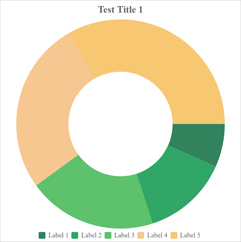

# Home

Here is a sample to build a simple pie chart.

## Build a simple pie chart
1. Navigate to https://web.powerapps.com, Click **Canvas app from blank**.


2. Click **Insert** > **Button** to insert a button


3. Click **Insert** > **Media** > **Image** to insert an image.


4. Move and resize the image and button.


5. Select the button, then set the OnSelect property with following code:


```javascript
UpdateContext({
    chartOptions:{
        type:"pie",
        data:Table(
            {key:"", values:[]},
            {key:"labels", values:["Label 1","Label 2","Label 3","Label 4","Label 5"]},
            {key:"values", values:["100","200","300","400","500"]}
        ),
        options:Table(
            {key:"",value:""},
            {key:"title", value:"Test Title 1"},
            {key:"legend", value:"true"},
            {key:"legend.source", value:"labels"},
            {key:"pie.innerRadius", value:"0.5"}
        )
    }
})
```

6. Copy the source code of charts


7. Paste the source code to the `Image` property of the image control.


8. Click the **Play** icon


9. Click the button, you can see this chart.



## Chart Options

You can see, the configuration object `chartOptions` contains 3 properties: **type**, **data** and **options**.

### Type

For now, we provide following types of charts:

| Chart Type | Type |
|:-:|:-:|
| [Pie Chart](pie.md) | **pie** |
| [Radar Chart](radar.md) | **radar** |
| [Line Chart](line.md) | **line** |
| [Bar Chart](bar.md) | **bar** |
| [Scatter Chart](scatter.md) | **scatter** |
| [Candle Stick Chart](candle.md) | **candle** |
| [Solid Gauge Chart](solidGauge.md) | **solidGauge** |
| [Funnel Chart](funnel.md) | **funnel** |

### Data

To support more types of data, we just split data in to one-dimensional array, and convert all items to string.

For examples:

```javascript
data:Table(
    {key:"", values:[""]},
    {key:"legends", values:["Test 1","Test 2","Test 3"]},
    {key:"labels", values:["Label 1","Label 2","Label 3","Label 4","Label 5","Label 6","Label 7","Label 8"]},
    {key:"1.y", values:["120", "132", "101", "134", "90", "230", "210", "101"]},
    {key:"2.y", values:["220", "182", "191", "234", "290", "330", "310", "182"]},
    {key:"3.y", values:["150", "232", "201", "154", "190", "330", "410", "190"]}
),
```

This sample is for a line chart with 3 lines.

#### Define Format
In this sample, we use `{key:"", values:[""]},` to define format of all data items.

#### Multi Series
We use key `legends` to define names of all series. You can change it to a custom value by using option `legend.source`. And the key of the data of the series will be looks like this: `index.x`, `index.y`, `index.z`. The index will start at `1`. You don't need to provide all these x, y, z in each charts.

#### Known Issues
For now, you can only provide 100 points. If you want to display more points, please follow [this](contribute.md?id=add-more-points).

### Options

You can customize the chart using `options`.

For Examples:

```javascript
options:Table(
    {key:"",value:""},
    {key:"title", value:"Test Title 1"},
    {key:"legend", value:"true"},
    {key:"legend.source", value:"labels"},
    {key:"pie.innerRadius", value:"0.5"}
)
```

The `options` is a table with key and value. It defines how the chart looks like.

You can see more information in [here](chart.md).

## Display Multiple Charts

If you want to display multiple charts in 1 screen, you can do it by changing context variable name:

For Example:


1. Change context name like this:
```javascript
UpdateContext({
    chartOptions:{
        type:"bar",
        data:Table(
            {key:"", values:[""]},
            {key:"legends", values:["Test 1","Test 2","Test 3"]},
            {key:"labels", values:["Label 1","Label 2","Label 3","Label 4","Label 5","Label 6","Label 7","Label 8"]},
            {key:"1.y", values:["120", "132", "101", "134", "90", "230", "210", "101"]},
            {key:"2.y", values:["220", "182", "191", "234", "290", "330", "310", "182"]},
            {key:"3.y", values:["150", "232", "201", "154", "190", "330", "410", "190"]}
        ),
        options:Table(
            {key:"",value:""},
            {key:"title", value:"Test Title 1"},
            {key:"legend", value:"true"},
            {key:"legend.source", value:"legends"},
            {key:"bar.stacked", value:"false"}
        )
    },
    chartOptionsPie:{
        type:"pie",
        data:Table(
            {key:"", values:[""]},
            {key:"labels", values:["Label 1","Label 2","Label 3","Label 4","Label 5","Label 6","Label 7","Label 8"]},
            {key:"values", values:["120", "132", "101", "134", "90", "230", "210", "101"]}
        ),
        options:Table(
            {key:"",value:""},
            {key:"title", value:"Test Title 1"},
            {key:"legend", value:"true"},
            {key:"legend.source", value:"labels"},
            {key:"pie.innerRadius", value:"0.5"}
        )
    }
})
```

2. Change the name of the context in Image control that contains chart like this.

```javascript
Concat(Table({chart:chartOptionsPie})
```