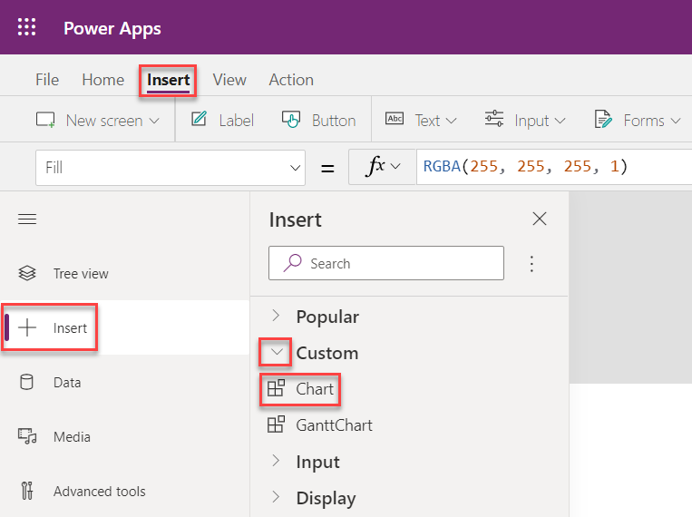

# Quick Start

In this guide, we will show you how to import the Canviz Power Apps Chart Components and add a pie chart to a Canvas app.

### Create a Canvas App

Navigate to https://web.powerapps.com,  then click **Canvas app from blank**:


Input a name, and select a format. Then click **Create**.


### Enable Components Feature

Canvas components are now available as an experimental feature. Follow the steps below to enable it.

1. Click **File**.
2. Click **App settings** > **Advanced settings**.
3. Turn on **Components** in Experimental features.


Click the back arrow at the top left to navigate back to PowerApps Studio.

### Import Chart Components

Click **Insert**, then click **Components** > **Import component**.


On the popup dialog, select **Chart Components V2.msapp**, then click Open.

Wait for a while, chart components will be loaded to the **Components** tab.


### Add a Pie Chart

Click **Screens**, then click **Insert** > **Components** > **Chart**.



Select the newly added chart component, then configure its properties:


* **Size**: 360 × 360

* **Type**: Input "Pie".

* **Title**: This is a record property. Let's edit its field values in the formula bar. Update the text to "Favorite Types of Movies".

  

* **Subtitle**: This is also a record property. Set its text to empty to hide it.

  ```javascript
  {
      text: "",
      ...
  }
  ```

* **Options**: Update its value to

  ```javascript
  Table(
      { key:"pie.innerRadius", value:"0.7" }
  )
  ```

* **Data**: Update its value to

  ```javascript
  {
      labels: ["Comedy","Action","Romance", "Drama"],
      table: Table(
          { key:"values", values: [4, 5, 6, 1] }
      )
  }
  ```

Then we will get a chart like below:


