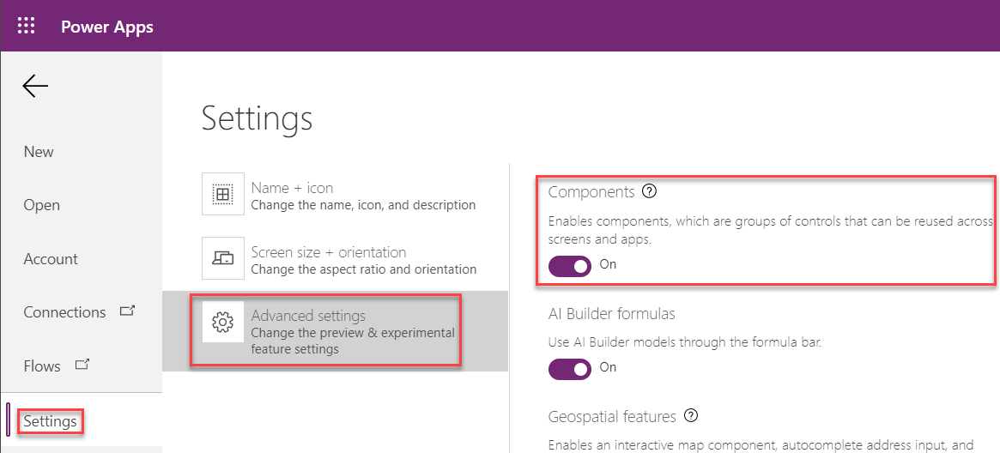

# Quick Start

In this guide, we will show you how to Create a Canvas Power App, import the Canviz Power Apps Chart Components and add a pie chart to the Canvas Power App.

### Create a Canvas Power App

Navigate to https://web.powerapps.com, then click **Canvas app from blank**:


Enter an **App name**, select a **Format**, and click **Create**.


### Enable Components Feature

The Components feature should be enabled by default.  Double check it is enabled.

1. Click **File**.
2. Click **Settings** > **Advanced settings**.
3. Ensure the **Components** feature is turned on.



Click the back arrow at the top left to navigate back to Power Apps Studio.

### Import Chart Components

Click **Insert**, then click **Components** > **Import component**.


Click **Upload file**, and select the **Chart Components V2.msapp** file, then click **Open**.

Wait for a little bit and the Canvas Power Apps Chart Components will appear in the **Components** tab.


### Add a Pie Chart

Expand the tree view, then click **Insert**.

Expand the **Custom** section, then click **Chart**.


Select the newly added chart component, then configure the chart properties.


To make a Pie chart, enter Pie in the Type property.  Pie is the default Type property.
* **Type**: Pie

To change the size of the chart, click the Advanced tab and change the Height and Width properties.
* **Size**: 360 × 360

  

* **Title**: To change the Title, edit the Title property.  The Title property is a record property.  Edit the value in the formula bar.  Update the value for the text field in the Title property to "Favorite Types of Movies".

  

* **Subtitle**: The Subtitle is also a record property. Set its text field to empty to hide it.

  ```javascript
  {
      text: "",
      ...
  }
  ```
* **Options**: Options allow you to configure the look and feel of the chart to a large degree.  For example, to change the size of the inner radius for the pie chart, simply set the pie.InnerRadius property.  Update the Options property with the following code.  For more details about the various options properties, please see the dcoumentation page for each chart.

  ```javascript
  Table(
      { key:"pie.innerRadius", value:"0.7" }
  )
  ```

* **Data**: Just like the name says, this property contains the data the chart renders.  Update the Daata property with the following code.  Keep in mind, this property can be set at runtime so you can make these charts dynamic.

  ```javascript
  {
      labels: ["Comedy","Action","Romance", "Drama"],
      table: Table(
          { key:"values", values: [4, 5, 6, 1] }
      )
  }
  ```

Now take a look at your chart!


