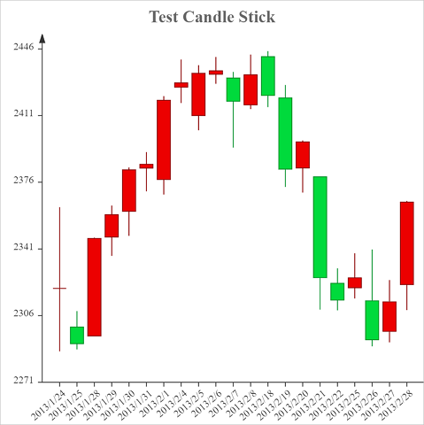

# Candle Stick

Here are options to candle stick chart.

```javascript
{
    type:"candle",
    data:Table(
        {key:"", values:[""]},
        {key:"labels", values:["2013/1/24", "2013/1/25", "2013/1/28", "2013/1/29", "2013/1/30", "2013/1/31", "2013/2/1", "2013/2/4", "2013/2/5", "2013/2/6", "2013/2/7", "2013/2/8", "2013/2/18", "2013/2/19", "2013/2/20", "2013/2/21", "2013/2/22", "2013/2/25", "2013/2/26", "2013/2/27", "2013/2/28"]},
        {key:"open", values:["2320.26", "2300", "2295.35", "2347.22", "2360.75", "2383.43", "2377.41", "2425.92", "2411", "2432.68", "2430.69", "2416.62", "2441.91", "2420.26", "2383.49", "2378.82", "2322.94", "2320.62", "2313.74", "2297.77", "2322.32"]},
        {key:"close", values:["2320.26", "2291.3", "2346.5", "2358.98", "2382.48", "2385.42", "2419.02", "2428.15", "2433.13", "2434.48", "2418.53", "2432.4", "2421.56", "2382.91", "2397.18", "2325.95", "2314.16", "2325.82", "2293.34", "2313.22", "2365.59"]},
        {key:"lowest", values:["2287.3", "2288.26", "2295.35", "2337.35", "2347.89", "2371.23", "2369.57", "2417.58", "2403.3", "2427.7", "2394.22", "2414.4", "2415.43", "2373.53", "2370.61", "2309.17", "2308.76", "2315.01", "2289.89", "2292.03", "2308.92"]},
        {key:"highest", values:["2362.94", "2308.38", "2346.92", "2363.8", "2383.76", "2391.82", "2421.15", "2440.38", "2437.42", "2441.73", "2433.89", "2443.03", "2444.8", "2427.07", "2397.94", "2378.82", "2330.88", "2338.78", "2340.71", "2324.63", "2366.16"]}
    ),
    options:Table(
        {key:"",value:""},
        {key:"title", value:"Test Candle Stick"}
    )
}
```


You can also change the style of [X Axis](axes.md?id=x-axis) and [Y Axis](axes.md?id=y-axis) of the chart by following options.

| Options of Axes | Default Value |
|:-|:-:|
| x | `true` |
| x.title |  |
| x.title.y | `-10` |
| x.title.align | `right` |
| x.title.fontSize | `14` |
| x.title.fontFamily |  |
| x.title.fontWeight | `bold` |
| x.title.fontStyle | `normal` |
| x.title.color | `#333333` |
| x.title.additionalStyles |  |
| x.height | `20` |
| x.lineWidth | `1` |
| x.lineColor | `#333333` |
| x.tickLength | `5` |
| x.tickWidth | `1` |
| x.labels | `true` |
| x.labels.format | `0` |
| x.labels.rotation | `-40` |
| x.labels.fontSize | `12` |
| x.labels.fontFamily |  |
| x.labels.fontWeight | `bold` |
| x.labels.fontStyle | `normal` |
| x.labels.color | `#333333` |
| x.labels.additionalStyles |  |
| y | `true` |
| y.title |  |
| y.title.align | `right` |
| y.title.fontSize | `14` |
| y.title.fontFamily |  |
| y.title.fontWeight | `bold` |
| y.title.fontStyle | `normal` |
| y.title.color | `#333333` |
| y.title.additionalStyles |  |
| y.align | `left` |
| y.step | `0` |
| y.min | `0` |
| y.max | `0` |
| y.width | `50` |
| y.lineWidth | `1` |
| y.lineColor | `#333333` |
| y.tickLength | `5` |
| y.tickWidth | `1` |
| y.padTop | `20` |
| y.labels | `true` |
| y.labels.format | `0` |
| y.labels.fontSize | `12` |
| y.labels.fontFamily |  |
| y.labels.fontWeight | `bold` |
| y.labels.fontStyle | `normal` |
| y.labels.color | `#333333` |
| y.labels.additionalStyles |  |

## candle.downColor

Bar color if close price is less than open price.

> The default value is `#00da3c`.

## candle.upColor

Bar color if close price is larger than open price.

> The default value is `#ec0000`.

## candle.downBorderColor

Border color if close price is less than open price.

> The default value is `#008f28`.

## candle.upBorderColor

Border color if close price is larger than open price.

> The default value is `#8a0000`.

## candle.itemGap

Gap between 2 items

> The default value is `5`.

## candle.fillOpacity

Fill opacity of the bar

> The default value is `1`.

## candle.borderWidth

Width of the border

> The default value is `1`.