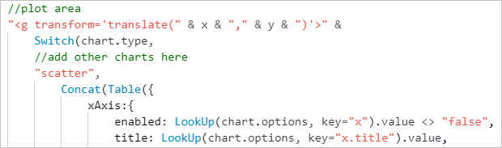
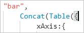

# Contribute

## Add more points

We provide support for up to 100 data points. If you want to increase that number, just add a number to index array.

The index array looks like this:

```javascript
indexes:[
    1,2,3,4,5,6,7,8,9,10
]
```
The actual indexes will be calculated from indexes from `1 ~ 10*10=100`.

If you add a `11` to the end of the indexes, you can support `11*11=121` points now.

## Add Chart Types

If you want to add new chart types, please following these steps:

1. Copy source formula and change an existing chart type to `target type`.

> You can find it by comment `//add other charts here`



2. Consider the format of **data** section

> For example, If you want to display a scatter chart

```javascript
//Original Data
{
    "Series 1":[[x1,y1,z1],[x2,y2,z2],[x3,y3,z3]]
    "Series 2":[[x1,y1,z1],[x2,y2,z2],[x3,y3,z3]]
}

//Data Object
data:Table(
    {key:"", values:[]},
    {key:"legends", values:["Series 1","Series 2"]},
    {key:"1.x", values:["x1","x2","x3"]},
    {key:"1.y", values:["y1","y2","y3"]},
    {key:"1.z", values:["z1","z2","z3"]},
    {key:"2.x", values:["x1","x2","x3"]},
    {key:"2.y", values:["y1","y2","y3"]},
    {key:"2.z", values:["z1","z2","z3"]}
),
```

3. Change `UpdateContext` action to build sample options

4. Build new Charts

> You can build custom options by these formulas:

```javascript
//Numeric value
Round(Value(LookUp(chart.options, key = "x.title.y").value),3)
//Numeric value with default value
Round(Value(Coalesce(LookUp(chart.options, key = "x.title.y").value,"-10")),3)
//String value
LookUp(chart.options, key="x.title").value
//String value with default value
Coalesce(LookUp(chart.options, key="x.title.color").value,"#333333")
//Boolean value default to `true`
LookUp(chart.options, key="x").value <> "false"
//Boolean value default to `false`
LookUp(chart.options, key="bar.stacked").value = "true"
//Enum values
If(LookUp(chart.options, key="x.title.align").value = "left","left","right")
```

6. After new chart built, you can copy the type name and formua in `Switch` function to build chart to comment `//add other charts here`

