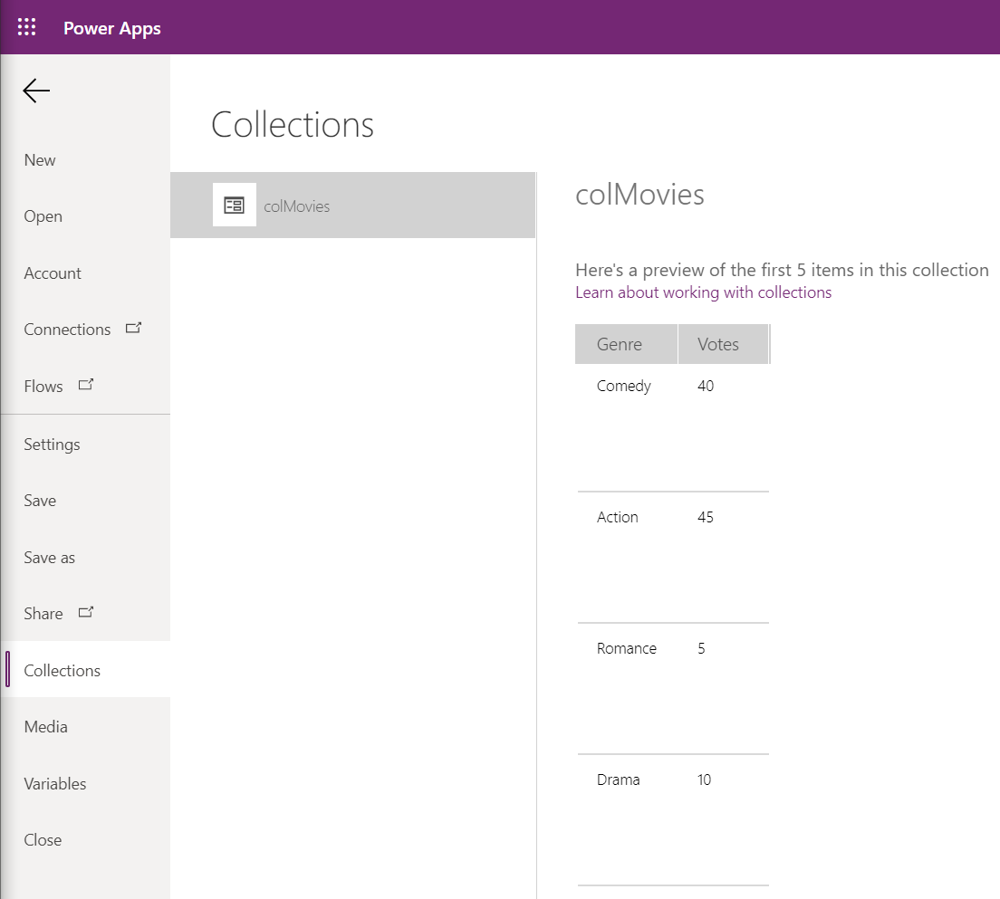

# Data Integration

In this guide, we will show you how to connect charts to dynamic data.

### Prerequisites

First follow the steps in the [Quick Start guide](/).  This guide will show you how to display data from an Excel Workbook stored in One Drive for Business in the Solid Gauge chart you created in the [Quick Start guide](/).

### Upload Excel File To OneDrive for Business

1. Download the [ChartData.xlsx](/../master/ChartData.xlsx) Excel Workbook and save it to your computer.
1. Log in to OneDrive for Business and upload the **ChartData.xlsx** file.
1. Remember where you upload the file.

### Add One Drive for Business Connection

Now you will connect the PowerApp to the Excel file you uploaded to OneDrive.  The Excel files has a Data Table in it named Movies.

1. In the Power Apps editor, open the Power App you created in the Quick Start guide.
1. Expand the left menu.
1. Select **Data**.
1. In the searchbox, enter **OneDrive for Business**.
1. Select the **OneDrive for Business** connector in the list.
  
1. Click **Add a connection**.
1. Click **Connect**.
1. Log in if prompted.
1. Browse to the OneDrive location where you saved the ChartData.xlsx file.
1. Select the **ChartData.xlsx** file.
1. Check the **Movies** checkbox.
1. Click **Connect**.
  
### Return Data From Excel

1. Add a button to the Power App.
1. Change the button's **Text** property to:
  ```Get Data From Excel```  
1. Add the following code to the Button's **OnSelect** event to return the data from Excel and store it in a local collection named **colMovies**.
  ```ClearCollect(colMovies, Movies)```
1. Hold down the **ALT key on the keyboard** and click the **Get Data From Excel** button.  
1. Click **File**.
1. Click **Collections**.
1. Click **colMovies**.
You should now see the following data in the collection. If you do not see any data in the gallery at this point then recheck your work.  Do not continue until you have data in the colMovies collection.
  

### Configure Chart To Use Dynamic Data

1. Select the chart component you configured to display as a Solid Gauge.  
1. Select the **Data** property in the dropdown list.
1. Replace the Data property with the following code.  This code tells the chart to use a global variable named **gblData** for the data in the chart.  Anytime the value of **gblData** changes the chart will automatically update.  Nice!
  ```
  gblData
  ```
  
    
### Process Data And Bind To Chart

1. Add another Button to the Power App.
1. Change the button's **Text** property to:
  ```Process And Bind Data```  
1. Add the following code the the **OnSelect** event to create the **gblData** global variable with data from the colMovies collection.
  ```
  Set(
    gblData,
    {
        //Use the Genre column to specify the labels
        labels: ForAll(
            colMovies.Genre,
            Genre
        ),
        //Use the Votes column to specify the data
        table: Table(
            {
                key: "values",
                values: ForAll(
                    colMovies.Votes,
                    Votes
                )
            }
        )
    }
  );
  ```

### Test

1. Hold down the **ALT key on the keyboard** and click the **Process And Bind Data** button.  
1. You should now see the following data in the chart.
  
  
> **Note:** This example illustrates a two stage process to acquire the data, then bind it to the chart when a button is clicked.  The example was created like this to make it clear how to do each part.  **This two stage process is not required.**  You can also return and process the data without any user interaction by simply moving the code from both of the button **OnSelect** events to the Power App's **OnStart** event or to an **OnVisible** event for any screen, like this:

```
  ClearCollect(colMovies, Movies);
  Set(
    gblData,
    {
        //Use the Genre column to specify the labels
        labels: ForAll(
            colMovies.Genre,
            Genre
        ),
        //Use the Votes column to specify the data
        table: Table(
            {
                key: "values",
                values: ForAll(
                    colMovies.Votes,
                    Votes
                )
            }
        )
    }
  );
  ```
### Another Approach
Instead of using the ForAll loop to populate the global variable bound to the data property, you can follow the pattern Jese Navaranjan demonstrates in [this video](https://www.youtube.com/watch?v=wyG-4XoLpvE).  It's quite elegant!  Thanks for sharing, Jese!

### Celebrate

Congratulations, now you know a pattern to integrate the charts with any data source.

Now take a moment to spread the word about these lovely components!  :)
