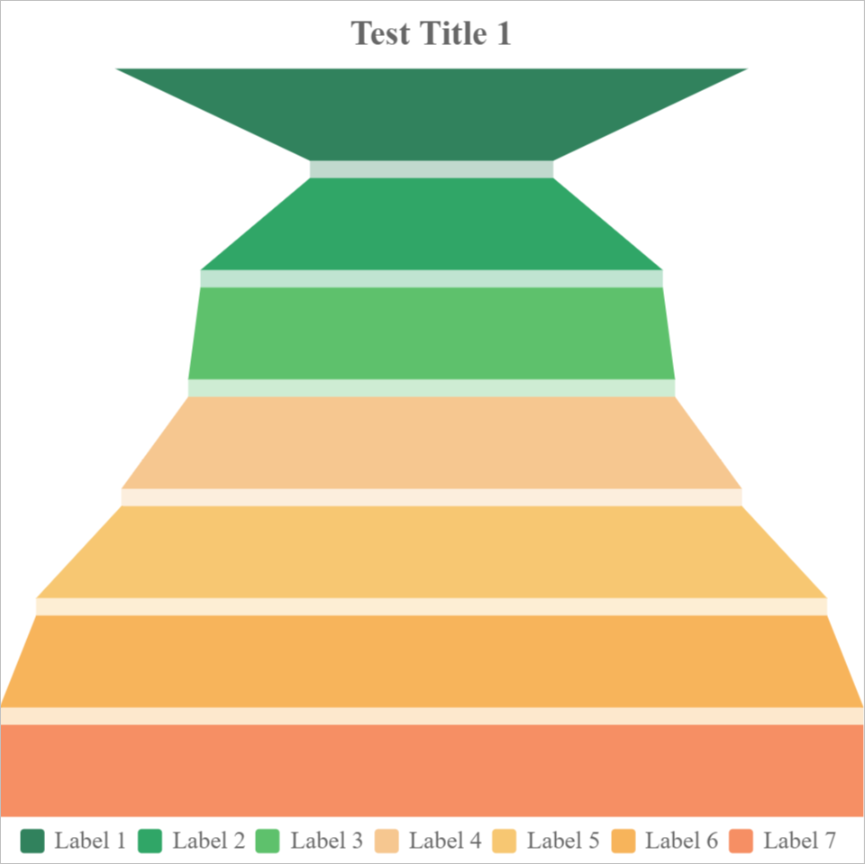
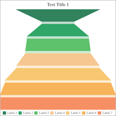
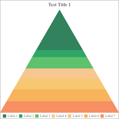
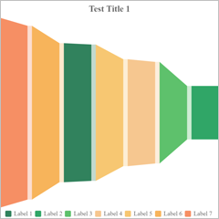
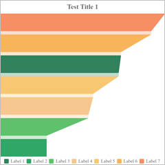
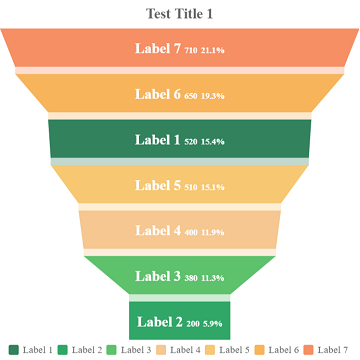

# Solid Gauge

### Sample



**Data**

```javascript
{
    legends: ["Test 1", "Test 1"],
    labels: ["Label 1","Label 2","Label 3","Label 4","Label 5"],
    table: Table(
        { key:"values", values: [90, 20, 40, 80, 50] }
    )
}
```

**Options**

```javascript
Table(
    { key: "legend", value: "true" },
    { key: "legend.source", value: "labels" }
)
```

### All Options

| Key                     | Remark                                                       |
| ----------------------- | ------------------------------------------------------------ |
| funnel.mode             | The funnel chart has 3 modes, **ladder**<br />, **rectangle** and **pyramid**. The default value is `ladder`.<br />`ladder`<br /><br />`rectangle`:<br /><br />`pyramid`:<br /><br />In pyramid mode, the area(**not height**) of parts are calculated from input values. |
| funnel.sort             | You can sort input values. The direction can be **none**, **ascending** and **descending**. The default value is `none`.<br />For example, sort in descending direction looks like this:<br /> |
| funnel.orientation      | You can display the chart in different orientations. Can be **vertical** and **horizontal**. The default value is `vertical`.<br /> For example, horizontal mode looks like this:<br /> |
| funnel.align            | You can also align all bars aside. In horizontal mode, can be **top**, **middle** and **bottom**. In vertical mode, can be **left**, **center** and **right**. The default value is `center`.<br />  For example, align to left looks like this:<br /> |
| funnel.maxBarLength     | You can change the max bar length of the chart. Can be **0~1**. The default value is `1`. |
| funnel.itemGap          | You can change gap between two bars. The default value is `10`. |
| funnel.connectorColor   | You can change the color of the gap. The default value is data color. |
| funnel.connectorOpacity | You can also change the opacity of the gap fill. The default value is `0.3`. |

#### Labels Options

A funnel chart has 3 labels. When all of them enabled, it look like below:



From left to right, they are labels, value labels, and percentage labels.

| Key                                                          | Remark                                                       |
| ------------------------------------------------------------ | ------------------------------------------------------------ |
| funnel.labels<br />funnel.labels.value<br />funnel.labels.percentage | Should display labels or not. Can be **true** or **false**. The default value is `false`. |
| funnel.labels.value.dx<br />funnel.labels.percentage.dx      | X Offset of labels.                                          |
| funnel.labels.value.dy<br />funnel.labels.percentage.dy      | X Offset of labels.                                          |
|                                                              | How to calculate the percentage value. Available values:<br />`sum`: value / sum of all values<br />`max`: value / max value<br />`last`: value / value of last data. |
| <br />funnel.labels.align<br />funnel.labels.value.align<br />funnel.labels.percentage.align | Alignment of the labels. Can be **left**, **center** and **right**. The default value is `center`. |
| funnel.labels.verticalAlign<br />funnel.labels.value.verticalAlign<br />funnel.labels.percentage.verticalAlign | Vertical Alignment of the labels. Can be **top**, **middle** and **bottom**. The default value is `middle`. |
| funnel.labels.fontSize<br />funnel.labels.value.fontSize<br />funnel.labels.percentage.fontSize | Font size of labels. The default value is `20`               |
| funnel.labels.fontFamily<br />funnel.labels.value.fontFamily<br />funnel.labels.percentage.fontFamily | Font family of labels.                                       |
| funnel.labels.fontWeight<br />funnel.labels.value.fontWeight<br />funnel.labels.percentage.fontWeight | Font weight of labels, can be CSS font weight values.        |
| funnel.labels.fontStyle<br />funnel.labels.value.fontStyle<br />funnel.labels.percentage.fontStyle | Font style of labels, can be CSS font style values.          |
| funnel.labels.color<br />funnel.labels.value.color<br />funnel.labels.percentage.color | Color of labels. The default value is `#ffffff`.             |
| funnel.labels.additionalStyles<br />funnel.labels.value.additionalStyles<br />funnel.labels.percentage.additionalStyles | You can add other CSS style rules here.                      |


