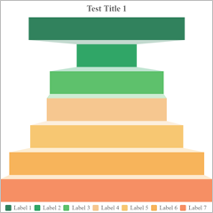

# Solid Gauge

Here are sample options to build a funnel chart.

```javascript
{
    type:"funnel",
    data:Table(
        {key:"", values:[]},
        {key:"labels", values:["Label 1","Label 2","Label 3","Label 4","Label 5","Label 6","Label 7"]},
        {key:"values", values:["520","200","380","400","510","650","710"]}
    ),
    options:Table(
        {key:"",value:""},
        {key:"title", value:"Test Title 1"},
        {key:"legend", value:"true"},
        {key:"legend.source", value:"labels"}
    )
}
```


## funnel.mode

The funnel chart has 3 modes, **ladder**, **rectangle** and **pyramid**.

> The default value is `ladder`.

* The `ladder` mode looks like this:


* The `rectangle` mode looks like this:



* The `pyramid` mode looks like this:

> In pyramid mode, the area(**not height**) of parts are calculated from input values.


## funnel.sort

You can sort input values. The direction can be **none**, **ascending** and **descending**.

> The default value is `none`.

* For example, sort in descending direction looks like this:


## funnel.orientation

You can display the chart in different orientations. Can be **vertical** and **horizontal**.

> The default value is `vertical`.

* For example, horizontal mode looks like this:


## funnel.align

You can also align all bars aside. In horizontal mode, can be **top**, **middle** and **bottom**. In vertical mode, can be **left**, **center** and **right**

> The default value is `center`.

* For example, align to left looks like this:


## funnel.maxBarLength

You can change the max bar length of the chart. Can be **0~1**

> The default value is `1`.

## funnel.itemGap

You can change gap between two bars.

> The default value is `10`.

## funnel.connectorColor

You can change the color of the gap.

> The default value is data color.

## funnel.connectorOpacity

You can also change the opacity of the gap fill.

> The default value is `0.3`.

## funnel.labels

Should display labels or not. Can be **true** or **false**.

> The default value is `false`.


## funnel.labels.align

Alignment of the labels. Can be **left**, **center** and **right**.

> The default value is `center`.

## funnel.labels.verticalAlign

Vertical Alignment of the labels. Can be **top**, **middle** and **bottom**.

> The default value is `middle`.

## funnel.labels.fontSize

Font size of labels

> The default value is `20`

## funnel.labels.fontFamily

Font family of labels

## funnel.labels.fontWeight

Font weight of labels, can be CSS font weight values.

## funnel.labels.fontStyle

Font style of labels, can be CSS font style values.

## funnel.labels.color

Color of labels

> The default value is `#ffffff`.

## funnel.labels.additionalStyles

You can add other CSS style rules here.

## funnel.labels.value

Should display labels for values or not. Can be **true** or **false**.

> The default value is `false`.


## funnel.labels.value.dx

X Offset of value labels

> The default value is `0`.

## funnel.labels.value.dy

Y Offset of value labels

> The default value is `0`.

## funnel.labels.value.format

The format of value labels

> The default value is `"0"`.

## funnel.labels.value.fontSize

Font size of value labels

> The default value is `12`

## funnel.labels.value.fontFamily

Font family of labels

## funnel.labels.value.fontWeight

Font weight of labels, can be CSS font weight values.

## funnel.labels.value.fontStyle

Font style of labels, can be CSS font style values.

## funnel.labels.value.color

Color of labels

> The default value is `#ffffff`.

## funnel.labels.value.additionalStyles

You can add other CSS style rules here.

## funnel.labels.percentage

Should display labels for percentages or not. Can be **true** or **false**.

> The default value is `false`.


## funnel.labels.percentage.mode

How to calculate the percentage value. Can be **sum**, **max** or **last**.

| Mode of percentage | Value |
|:-|:-:|
| **sum** | value / sum of all values |
| **max** | value / max value |
| **last** | value / value of last data |

> The default value is `sum`.

## funnel.labels.percentage.dx

X Offset of percentage labels

> The default value is `0`.

## funnel.labels.percentage.dy

Y Offset of percentage labels

> The default value is `0`.

## funnel.labels.percentage.fontSize

Font size of percentage labels

> The default value is `12`

## funnel.labels.percentage.fontFamily

Font family of percentage labels

## funnel.labels.percentage.fontWeight

Font weight of percentage labels, can be CSS font weight values.

## funnel.labels.percentage.fontStyle

Font style of percentage labels, can be CSS font style values.

## funnel.labels.percentage.color

Color of percentage labels

> The default value is `#ffffff`.

## funnel.labels.percentage.additionalStyles

You can add other CSS style rules here.