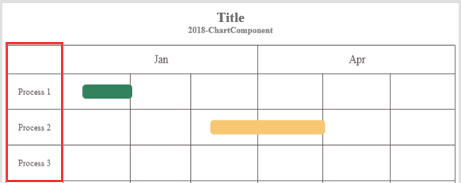

# Gantt

### Sample


**Title**

```javascript
{
    text: "Test Title 1",
    ...
}
```

**Subtitle**

```javascript
{
    text: "Sub Title",
    ...
}
```

**Legend**

```javascript
{
	enabled: true,
    source: "labels",
    ...
}
```

**Options**

```javascript
Table(
    {key:"gantt.type", value:"month"},
    {key:"gantt.step", value:"1"},
    {key:"gantt.startDate", value:"1/18/2018"},
    {key:"gantt.endDate", value:"5/25/2018"},
    {key:"gantt.lineColor", value:"#5a5252"},
    {key:"gantt.fontColor", value:"#5a5252"},
    {key:"gantt.barHeight", value:"20"},
    {key:"gantt.rowHeight", value:"50"},
    {key:"gantt.rowHeaderHeight", value:"40"},
    {key:"gantt.columnHeaderWidth", value:"80"},
    {key:"gantt.rowHeaderFontSize", value:"12"},
    {key:"gantt.rowHeaderFontSize", value:"12"}
)
```

**Data**

```javascript
{
    legends: ["Label1","Label2","Label3","Label4","Label5"],
    clabels: ["Process 1","Process 2","Process 3","Process 4","Process 5"],
    intervals: Table(
                   {start:"01/10/2018",end:"02/01/2018",colorindex:1,process:1},                            {start:"03/10/2018",end:"05/01/2018",colorindex:5,process:2}
               )
}
```

### All Options

| Key                        | Remark                                                       |
| -------------------------- | ------------------------------------------------------------ |
| gantt.type                 | Gantt chart type, now support two types, **month** means chart is separated by month, **week** means chart is separated by week. |
| gantt.step                 | Gantt chart step number, step number value mean unit. For example, **1** means one week/month:<br>**<br>3 **means three weeks/months.<br> |
| gantt.startDate            | Gantt chart start date string, date formatter is **mm/dd/yyyy**, for example **01/18/2019**. |
| gantt.endDate              | Gantt chart end date string, date formatter is **mm/dd/yyyy**, for example **09/28/2019**. |
| gantt.lineColor            | Gantt chart table line color string, for example **#5a5252**. |
| gantt.fontColor            | Gantt chart table headers font color string, for example **#5f5f5f**. |
| gantt.barHeight            | Gantt chart bar height, formatter should be valid number string |
| gantt.rowHeight            | Gantt chart each row  height, formatter should be valid number string.<br> |
| gantt.rowHeaderHeight      | Gant chart row headers height, formatter should be valid number string.<br/> |
| gantt.rowHeaderFontSize    | Gantt chart row headers font size, formatter is number, for example **15** means **15px**<br> |
| gantt.columnHeaderWidth    | Gant chart column headers width, formatter should be valid number string.<br/> |
| gantt.columnHeaderFontSize | Gantt chart row headers font size, formatter is number string, for example **12** means **12px**<br/> |

### All Data

| Key       | Remark                                                       |
| --------- | ------------------------------------------------------------ |
| legends   | Legends labels array.                                        |
| clabels   | Column headers labels.                                       |
| intervals | Bar recorders table.<br>**start**: Bar start date, date formatter is **mm/dd/yyyy**, for example **01/10/2018**.<br>**end**: Bar end date, date formatter is **mm/dd/yyyy**, for example **03/15/2018**.<br/>**colorindex**: Bar color index, should be keep same with legend index.<br/>**process**: Bar row location index. |