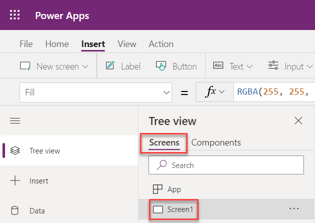

# Gantt Chart

### Prerequisites

First follow the steps in the [quick start guide](readme.md) to Create a Canvas Power App, Enable the Components Feature, and Import Chart Components.

After you have the prerequisites installed, then continue and add the Gantt chart component to a Canvas Power App.

### Add a Gantt Chart

In the Power Apps editor open the **Tree view**. 

Click the **Screens** tab, then select **Screen1**.



In the left menu, click **Insert**.

Expand the **Custom** section, then click **GanttChart**.


Select the newly added chart component, then configure the chart properties.


To change the size of the chart, click the Advanced tab and change the Height and Width properties.

- **Size**: 1150 × 640

- **Title**: To change the Title, edit the Title property. The Title property is a record property. Edit the value in the formula bar. Update the value for the text field in the Title property to "Important Project".

  

- **Subtitle**: The Subtitle is also a record property. Set its text field to empty to hide it.

  ```javascript
  {
      text: "",
      ...
  }
  ```

- **Options**: Options allow you to configure the look and feel of the chart to a large degree. For example, to set the start date for the chart simply set the gantt.startDate property. Update the Options property with the following code. For more details about the various options properties, please see the dcoumentation below.

  ```javascript
  Table(
      {key:"gantt.type", value:"month"},
      {key:"gantt.step", value:"3"},
      {key:"gantt.startDate", value:"01/18/2018"},
      {key:"gantt.endDate", value:"06/25/2018"},
  
      {key:"gantt.lineColor", value:"#5a5252"},
      {key:"gantt.fontColor", value:"#5a5252"},
  
      {key:"gantt.rowHeaderFontSize", value:"15"},
      {key:"gantt.columnHeaderFontSize", value:"12"},
  
      {key:"gantt.barHeight", value:"20"},
      {key:"gantt.rowHeight", value:"50"}
  )
  ```

- **Data**: Just like the name says, this property contains the data the chart renders. Update the Data property with the following code. Keep in mind, this property can be set at runtime so you can make these charts dynamic.

  ```javascript
  {
      legends: ["Label1","Label2","Label3","Label4","Label5"],
      clabels: ["Process 1","Process 2","Process 3","Process 4","Process 5"],
      intervals: Table(
          {start:"01/10/2018",end:"02/01/2018",colorindex:1,process:1},
          {start:"03/10/2018",end:"05/01/2018",colorindex:2,process:2},
          {start:"03/10/2018",end:"05/01/2018",colorindex:3,process:3},
          {start:"03/10/2018",end:"04/10/2018",colorindex:4,process:4},
          {start:"02/11/2018",end:"04/11/2018",colorindex:5,process:5}
      )
  }
  ```

Now take a look at your chart!


### All Options

| Key                        | Remark                                                       |
| -------------------------- | ------------------------------------------------------------ |
| gantt.type                 | Gantt chart type. Currently supports two types, **month** means chart is separated by month, **week** means chart is separated by week. |
| gantt.step                 | Gantt chart step number, step number value means unit. For example, **1** means one week/month:<br>**<br>3 **means three weeks/months.<br> |
| gantt.startDate            | Gantt chart start date string, date formatter is **mm/dd/yyyy**, for example **01/18/2019**. |
| gantt.endDate              | Gantt chart end date string, date formatter is **mm/dd/yyyy**, for example **09/28/2019**. |
| gantt.lineColor            | Gantt chart table line color string, for example **#5a5252**. |
| gantt.fontColor            | Gantt chart table headers font color string, for example **#5f5f5f**. |
| gantt.barHeight            | Gantt chart bar height, formatter should be valid number string |
| gantt.rowHeight            | Gantt chart each row  height, formatter should be valid number string.<br> |
| gantt.rowHeaderHeight      | Gantt chart row headers height, formatter should be valid number string.<br/> |
| gantt.rowHeaderFontSize    | Gantt chart row headers font size, formatter is number, for example **15** means **15px**<br> |
| gantt.columnHeaderWidth    | Gantt chart column headers width, formatter should be valid number string.<br/> |
| gantt.columnHeaderFontSize | Gantt chart row headers font size, formatter is number string, for example **12** means **12px**<br/> |

### All Data

| Key       | Remark                                                       |
| --------- | ------------------------------------------------------------ |
| legends   | Legends labels array.                                        |
| clabels   | Column headers labels.                                       |
| intervals | Bar recorders table.<br>**start**: Bar start date, date formatter is **mm/dd/yyyy**, for example **01/10/2018**.<br>**end**: Bar end date, date formatter is **mm/dd/yyyy**, for example **03/15/2018**.<br/>**colorindex**: Bar color index, should be keep same with legend index.<br/>**process**: Bar row location index. |
