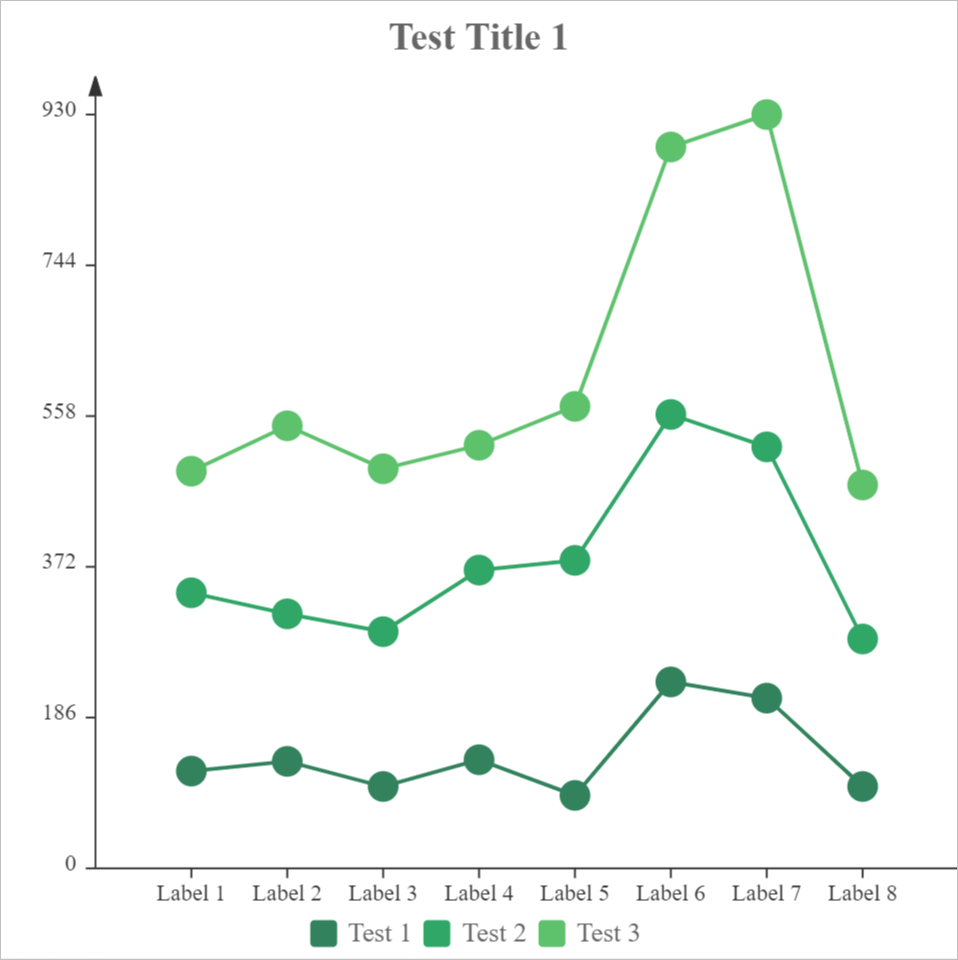

# Line

Here are options to line chart.

```javascript
{
    type:"line",
    data:Table(
        {key:"", values:[""]},
        {key:"legends", values:["Test 1","Test 2","Test 3"]},
        {key:"labels", values:["Label 1","Label 2","Label 3","Label 4","Label 5","Label 6","Label 7","Label 8"]},
        {key:"1.y", values:["120", "132", "101", "134", "90", "230", "210", "101"]},
        {key:"2.y", values:["220", "182", "191", "234", "290", "330", "310", "182"]},
        {key:"3.y", values:["150", "232", "201", "154", "190", "330", "410", "190"]}
    ),
    options:Table(
        {key:"",value:""},
        {key:"title", value:"Test Title 1"},
        {key:"legend", value:"true"},
        {key:"legend.source", value:"legends"},
        {key:"line.stacked", value:"true"}
    )
}
```


You can also change the style of [X Axis](axes.md?id=x-axis) and [Y Axis](axes.md?id=y-axis) of the chart by following options.

| Options of Axes | Default Value |
|:-|:-:|
| x | `true` |
| x.title |  |
| x.title.y | `-10` |
| x.title.align | `right` |
| x.title.fontSize | `14` |
| x.title.fontFamily |  |
| x.title.fontWeight | `bold` |
| x.title.fontStyle | `normal` |
| x.title.color | `#333333` |
| x.title.additionalStyles |  |
| x.height | `20` |
| x.lineWidth | `1` |
| x.lineColor | `#333333` |
| x.tickLength | `5` |
| x.tickWidth | `1` |
| x.labels | `true` |
| x.labels.format | `0` |
| x.labels.rotation | `0` |
| x.labels.fontSize | `12` |
| x.labels.fontFamily |  |
| x.labels.fontWeight | `bold` |
| x.labels.fontStyle | `normal` |
| x.labels.color | `#333333` |
| x.labels.additionalStyles |  |
| y | `true` |
| y.title |  |
| y.title.align | `right` |
| y.title.fontSize | `14` |
| y.title.fontFamily |  |
| y.title.fontWeight | `bold` |
| y.title.fontStyle | `normal` |
| y.title.color | `#333333` |
| y.title.additionalStyles |  |
| y.align | `left` |
| y.step | `0` |
| y.min | `0` |
| y.max | `0` |
| y.width | `50` |
| y.lineWidth | `1` |
| y.lineColor | `#333333` |
| y.tickLength | `5` |
| y.tickWidth | `1` |
| y.padTop | `20` |
| y.labels | `true` |
| y.labels.format | `0` |
| y.labels.fontSize | `12` |
| y.labels.fontFamily |  |
| y.labels.fontWeight | `bold` |
| y.labels.fontStyle | `normal` |
| y.labels.color | `#333333` |
| y.labels.additionalStyles |  |

## line.stacked

Should multiple series of the same type be stacked together. Can be **true** or **false**

> The default value is `false`.

## line.lineWidth

Line width of the line chart

> The default value is `2`.

## line.fillOpacity

Fill opacity of the line area

> The default value is `0`.

## line.markerSize

Size of the line marker

> The default value is `16`.

## line.marker

Type of the line marker.

Can be following values:

| Type | Marker |
|:-:|:-:|
| circle | <svg viewBox='-10 -10 20 20' width='20' height='20'><circle cx='0' cy='0' r='8' fill='#31825d'></circle></svg> |

> The default value is `circle`.