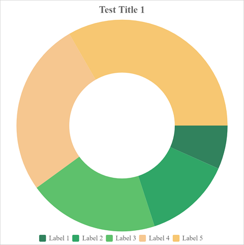
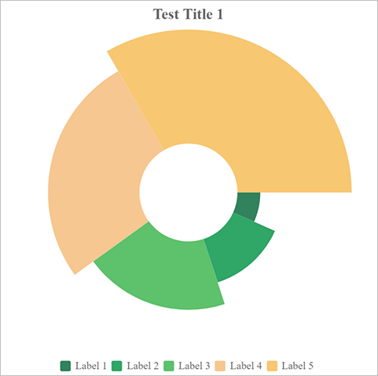
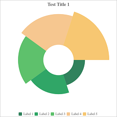

# Pie

### Sample



**Title**

```javascript
{
    text: "Test Title 1",
    ...
}
```

**Subtitle**

```javascript
{
    text: "",
    ...
}
```

**Legend**

```javascript
{
	enabled: true,
    source: "labels",
    ...
}
```

**Options**

```javascript
Table(
    { key: "pie.innerRadius", value: "0.5" }
)
```

**Data**

```javascript
{
    legends: ["Test 1", "Test 1"],
    labels: ["Label 1","Label 2","Label 3","Label 4","Label 5"],
    table: Table(
        { key:"values", values:[90, 20, 40, 80, 50] }
    )
}
```

### All Options

| Key             | Remark                                                       |
| --------------- | ------------------------------------------------------------ |
| pie.radius      | The outer radius of the pie chart. The value is the ratio of the max available radius. Can be `0 ~ 1`. For example, `0.5` means 50% of the chart area.<br />The default value is `1`. |
| pie.startAngle  | The start angle of the pie chart.                            |
| pie.innerRadius | The inner radius of the pie chart. The value is the ratio of the radius. For example, `0.5` means 50% of the radius. |
| pie.semiCircle  | Show pie chart in semi circle. Can be **true** or **false**. |
| pie.roseType    | Display pie chart in rose mode. Available values:<br />`none`:<br /><br />`radius`:<br /><br />`area`:<br /> |

