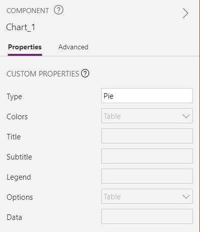

# Chart Properties

In the previous post, we updated some of the chart component properties.



In this post, we are going to provide more details of them.

### Type

The property determines the kind of chart. For now, we provide the following types:

| Type        | Remarks                    |
| ----------- | -------------------------- |
| Pie         | TODO: add some image here? |
| Solid Gauge |                            |
| Funnel      |                            |
| Line        |                            |
| Bar         |                            |
| Radar       |                            |
| Scatter     |                            |
| Candle      |                            |

> **Note**: Gantt chart uses different data payload. We created a separated component for it. Please check [gantt](gantt.md).  

### Colors

The property contains a series of colors:

```json
["#31825d", "#30a667", "#5ec16c", "#f6c790", "#f7c772", "#f7b45b", "#f68f64", "#d46068", "#946eb0", "#769acc", "#60c5ea"]
```

They will be used by different labels or legends. 

[All CSS color values](https://www.w3schools.com/colors/default.asp) are allowed. For examples: `Blue`, `#808080`. 

> **Note**: This also applies to other color fields, such as title color, line color.

### Title

This record property controls the text and styles of the title. It contains the following fields:

| Name             | Remark                                                       |
| ---------------- | ------------------------------------------------------------ |
| text             | Text of the title.<br />You may set it to empty to hide the title. |
| height           | Height of the title.                                         |
| align            | Align of the title.<br />Available values: left, center and right. |
| paddingTop       | Padding top of the title                                     |
| fontSize         | Font size of the title.                                      |
| fontFamily       | Font family of the title.                                    |
| fontWeight       | Font weight of the title.<br />Available values: normal and bold. |
| fontStyle        | Font style of the title.<br />Available values: normal and italic. |
| color            | Color of the title.                                          |
| additionalStyles |                                                              |

> **Note**: the available values for align, font weight and font style also apply to same type of fields in other properties.

### Subtitle

This record property controls the text and styles of the subtitle. It has the same fields as the title property.

### Legend

This record property controls the styles of the legend. 

| Name       | Remark                                                       |
| ---------- | ------------------------------------------------------------ |
| enable     | Show or hide the legend. Available values: true and false.   |
| source     | Data source of the legend. Available values:<br />labels: get items from the Data property's labels field<br />legends: get items from the Data property's legends field |
| placement  | Position of the legend. Available values: top, right, left and bottom. |
| width      | Width of the legend. Effective when placement set to top or bottom. |
| height     | Height of the legend. Effective when placement set to left or right. |
| itemGap    | Gap between legend items.                                    |
| fontSize   | Font size of the legend.                                     |
| fontFamily | Font family of the legend.                                   |
| fontWeight | Font weight of the legend.                                   |
| fontStyle  | Font style of the legend.                                    |
| color      | Color of the legend.                                         |
| align      | Align of the legend.                                         |

### Options

Via this property, we can control more details of the chart:

* X and Y Axes:

  ```json
  Table(
      { key:"x.labels.color", value:"#336699" }
      { key:"y.labels.fontWeight", value:"bold" }
  )
  ```

  For more details, please check [Axes](Axes.md).

* Chart special settings:

  ```json
  Table(
      { key:"pie.radius", value:"0.95" },
      { key:"pie.innerRadius", value:"0.75" }
  )
  ```

  For more details, please check the post for each chart.

### Data

Legends, labels and values are set via this property. Below is sample data for radar chart.

```json
{
    legends: ["Test 1", "Test 2", "Test 3"],
    labels: ["Label 1",  "Label 2",  "Label 3",  "Label 4",  "Label 5",  "Label 6",  "Label 7",  "Label 8"],
    table: Table(
        {key:"1.y", values:[500, 500, 500, 500, 500, 500, 500, 500]},
        {key:"2.y", values:[400, 400, 400, 400, 400, 400, 400, 400]},
        {key:"3.y", values:[300, 300, 300, 300, 300, 300, 300, 310]}
    )
}
```

For more details, please check the post for each chart.

> **Known Issue**: 
> By default, at most 100 points are supported. To support more points, for example 400, please follow add the following record to the chart's Options property:
>
> ```javascript
> { key: "indexes", value: "1,2,3,4,5,6,7,8,9,10,11,12,13,14,15,16,17,18,19,20" }
> ```
>
> The value contains 20 continuous numbers staring from 1 separated by comma. The maximum is 20 × 20 = 400. 