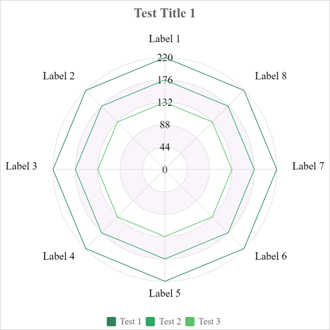

# Radar

Here are options to radar chart.

```javascript
{
    type:"radar",
    data:Table(
        {key:"", values:[]},
        {key:"legends", values:["Test 1","Test 2","Test 3"]},
        {key:"labels", values:["Label 1","Label 2","Label 3","Label 4","Label 5","Label 6","Label 7","Label 8"]},
        {key:"1.y", values:["500","500","500","500","500","500","500","500"]},
        {key:"2.y", values:["400","400","400","400","400","400","400","400"]},
        {key:"3.y", values:["300","300","300","300","300","300","300","300"]}
    ),
    options:Table(
        {key:"",value:""},
        {key:"title", value:"Test Title 1"},
        {key:"legend", value:"true"},
        {key:"legend.source", value:"legends"}
    )
}
```


You can also change the style of [Y Axis](axes?id=y-axis) of the chart by following options.

| Options of Y Axis | Default Value |
|:-|:-:|
| y.min | `0` |
| y.max | `0` |
| y.step | `0` |
| y.labels.color | `#000000` |

## radar.labelsColor

Color of labels of radar angles

> The default value is `#000000`.

## radar.lineWidth

Line width of the radar chart

> The default value is `1`.

## radar.plotLineColor

Color of the plot lines

> The default value is `#cccccc`.

## radar.plotLineWidth

Line width of the plot lines

> The default value is `0.5`.

## radar.backgroundOdd

Background of the odd plot area

> The default value is `#FFFFFF`.

## radar.backgroundEven

Background of the even plot area

> The default value is `#FAF4FB`.