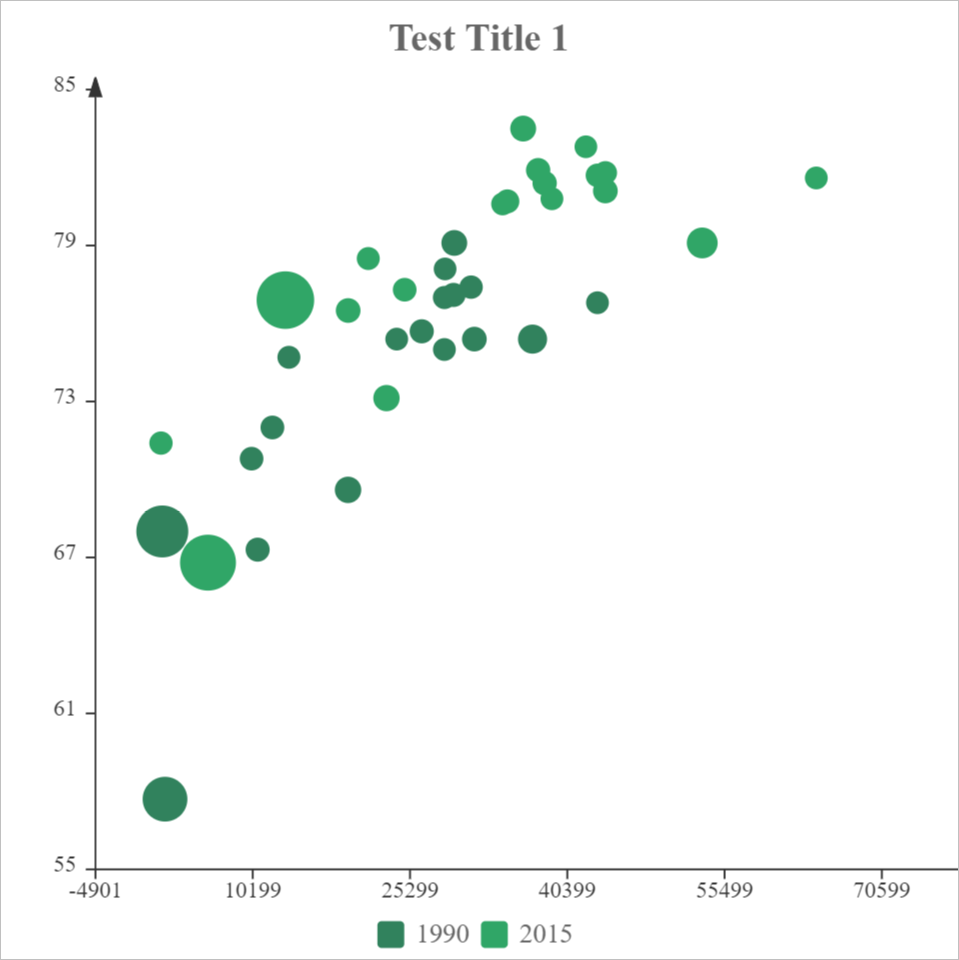

# Scatter

Here are options to scatter chart.

```javascript
{
    type:"scatter",
    data:Table(
        {key:"", values:[""]},
        {key:"legends", values:["1990","2015"]},
        {key:"1.x", values:["28604", "31163", "1516", "13670", "28599", "29476", "31476", "28666", "1777", "29550", "2076", "12087", "24021", "43296", "10088", "19349", "10670", "26424", "37062"]},
        {key:"1.y", values:["77", "77.4", "68", "74.7", "75", "77.1", "75.4", "78.1", "57.7", "79.1", "67.9", "72", "75.4", "76.8", "70.8", "69.6", "67.3", "75.7", "75.4"]},
        {key:"1.z", values:["17096869", "27662440", "1154605773", "10582082", "4986705", "56943299", "78958237", "254830", "870601776", "122249285", "20194354", "42972254", "3397534", "4240375", "38195258", "147568552", "53994605", "57110117", "252847810"]},
        {key:"2.x", values:["44056", "43294", "13334", "21291", "38923", "37599", "44053", "42182", "5903", "36162", "1390", "34644", "34186", "64304", "24787", "23038", "19360", "38225", "53354"]},
        {key:"2.y", values:["81.8", "81.7", "76.9", "78.5", "80.8", "81.9", "81.1", "82.8", "66.8", "83.5", "71.4", "80.7", "80.6", "81.6", "77.3", "73.13", "76.5", "81.4", "79.1"]},
        {key:"2.z", values:["23968973", "35939927", "1376048943", "11389562", "5503457", "64395345", "80688545", "329425", "1311050527", "126573481", "25155317", "50293439", "4528526", "5210967", "38611794", "143456918", "78665830", "64715810", "321773631"]}
    ),
    options:Table(
        {key:"",value:""},
        {key:"title", value:"Test Title 1"},
        {key:"legend", value:"true"},
        {key:"legend.source", value:"legends"}
    )
}
```


You can also change the style of [X Axis](axes.md?id=x-axis) and [Y Axis](axes.md?id=y-axis) of the chart by following options.

| Options of Axes | Default Value |
|:-|:-:|
| x | `true` |
| x.title |  |
| x.title.y | `-10` |
| x.title.align | `right` |
| x.title.fontSize | `14` |
| x.title.fontFamily |  |
| x.title.fontWeight | `bold` |
| x.title.fontStyle | `normal` |
| x.title.color | `#333333` |
| x.title.additionalStyles |  |
| x.step | `0` |
| x.min | `0` |
| x.max | `0` |
| x.height | `20` |
| x.lineWidth | `1` |
| x.lineColor | `#333333` |
| x.tickLength | `5` |
| x.tickWidth | `1` |
| x.labels | `true` |
| x.labels.format | `0` |
| x.labels.rotation | `0` |
| x.labels.fontSize | `12` |
| x.labels.fontFamily |  |
| x.labels.fontWeight | `bold` |
| x.labels.fontStyle | `normal` |
| x.labels.color | `#333333` |
| x.labels.additionalStyles |  |
| y | `true` |
| y.title |  |
| y.title.align | `right` |
| y.title.fontSize | `14` |
| y.title.fontFamily |  |
| y.title.fontWeight | `bold` |
| y.title.fontStyle | `normal` |
| y.title.color | `#333333` |
| y.title.additionalStyles |  |
| y.align | `left` |
| y.step | `0` |
| y.min | `0` |
| y.max | `0` |
| y.width | `50` |
| y.lineWidth | `1` |
| y.lineColor | `#333333` |
| y.tickLength | `5` |
| y.tickWidth | `1` |
| y.padTop | `20` |
| y.labels | `true` |
| y.labels.format | `0` |
| y.labels.fontSize | `12` |
| y.labels.fontFamily |  |
| y.labels.fontWeight | `bold` |
| y.labels.fontStyle | `normal` |
| y.labels.color | `#333333` |
| y.labels.additionalStyles |  |

## scatter.maxSize

Max size of the scatter marker

> The default value is `20`.

## scatter.minSize

Min size of the scatter marker

> The default value is `10`.

## scatter.fillOpacity

Fill opacity of the scatter marker

> The default value is `1`.

## scatter.borderWidth

Width of the border of the scatter marker

> The default value is `0`.

## scatter.borderColor

Color of the border of the scatter marker

> The default value is the color of the data series.