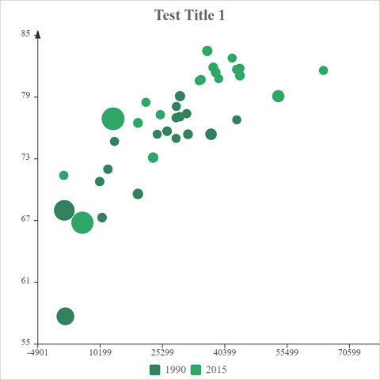

# Scatter

### Sample



**Title**

```javascript
{
    text: "Test Title 1",
    ...
}
```

**Subtitle**

```javascript
{
    text: "",
    ...
}
```

**Legend**

```javascript
{
	enabled: true,
    source: "legends",
    ...
}
```

**Options**

```javascript
Table(
    { key: "scatter.fillOpacity", value: "1" }
)
```

**Data**

```javascript
{
    legends: ["Test 1", "Test 2"],
    table: Table(
        { key:"1.x", values: [28604, 31163, 1516, 13670, 28599, 29476, 31476, 28666, 1777, 29550, 2076, 12087, 24021, 43296, 10088, 19349, 10670, 26424, 37062] },
        { key:"1.y", values: [77, 77.4, 68, 74.7, 75, 77.1, 75.4, 78.1, 57.7, 79.1, 67.9, 72, 75.4, 76.8, 70.8, 69.6, 67.3, 75.7, 75.4] },
        { key:"1.z", values: [17096869, 27662440, 1154605773, 10582082, 4986705, 56943299, 78958237, 254830, 870601776, 122249285, 20194354, 42972254, 3397534, 4240375, 38195258, 147568552, 53994605, 57110117, 252847810] },
        { key:"2.x", values: [44056, 43294, 13334, 21291, 38923, 37599, 44053, 42182, 5903, 36162, 1390, 34644, 34186, 64304, 24787, 23038, 19360, 38225, 53354] },
        { key:"2.y", values: [81.8, 81.7, 76.9, 78.5, 80.8, 81.9, 81.1, 82.8, 66.8, 83.5, 71.4, 80.7, 80.6, 81.6, 77.3, 73.13, 76.5, 81.4, 79.1] },
        { key:"2.z", values: [23968973, 35939927, 1376048943, 11389562, 5503457, 64395345, 80688545, 329425, 1311050527, 126573481, 25155317, 50293439, 4528526, 5210967, 38611794, 143456918, 78665830, 64715810, 321773631] }
    )
}
```

* Records whose key starts with `1.` are data for the first legend item,  and records whose key starts with `2.` are data for the second legend item.

* Records whose key ends with `.x` and `.y` determine the positions of points, and records whose key ends `.z` determines the sizes of points.

### All Options

| Key                 | Remark                                                       |
| ------------------- | ------------------------------------------------------------ |
| scatter.maxSize     | Max size of the scatter marker. The default value is `20`.   |
| scatter.minSize     | Min size of the scatter marker. The default value is `10`.   |
| scatter.fillOpacity | Fill opacity of the scatter marker. The default value is `1`. |
| scatter.borderWidth | Width of the border of the scatter marker. The default value is `0`. |
| scatter.borderColor | Color of the border of the scatter marker. The default value is the color of the data series. |

You can also change the style of [axes](axes.md) of the chart by following options.

| Options of Axes | Default Value |
|:-|:-:|
| x | `true` |
| x.title |  |
| x.title.y | `-10` |
| x.title.align | `right` |
| x.title.fontSize | `14` |
| x.title.fontFamily |  |
| x.title.fontWeight | `bold` |
| x.title.fontStyle | `normal` |
| x.title.color | `#333333` |
| x.title.additionalStyles |  |
| x.step | `0` |
| x.min | `0` |
| x.max | `0` |
| x.height | `20` |
| x.lineWidth | `1` |
| x.lineColor | `#333333` |
| x.tickLength | `5` |
| x.tickWidth | `1` |
| x.labels | `true` |
| x.labels.format | `0` |
| x.labels.rotation | `0` |
| x.labels.fontSize | `12` |
| x.labels.fontFamily |  |
| x.labels.fontWeight | `bold` |
| x.labels.fontStyle | `normal` |
| x.labels.color | `#333333` |
| x.labels.additionalStyles |  |
| y | `true` |
| y.title |  |
| y.title.align | `right` |
| y.title.fontSize | `14` |
| y.title.fontFamily |  |
| y.title.fontWeight | `bold` |
| y.title.fontStyle | `normal` |
| y.title.color | `#333333` |
| y.title.additionalStyles |  |
| y.align | `left` |
| y.step | `0` |
| y.min | `0` |
| y.max | `0` |
| y.width | `50` |
| y.lineWidth | `1` |
| y.lineColor | `#333333` |
| y.tickLength | `5` |
| y.tickWidth | `1` |
| y.padTop | `20` |
| y.labels | `true` |
| y.labels.format | `0` |
| y.labels.fontSize | `12` |
| y.labels.fontFamily |  |
| y.labels.fontWeight | `bold` |
| y.labels.fontStyle | `normal` |
| y.labels.color | `#333333` |
| y.labels.additionalStyles |  |
