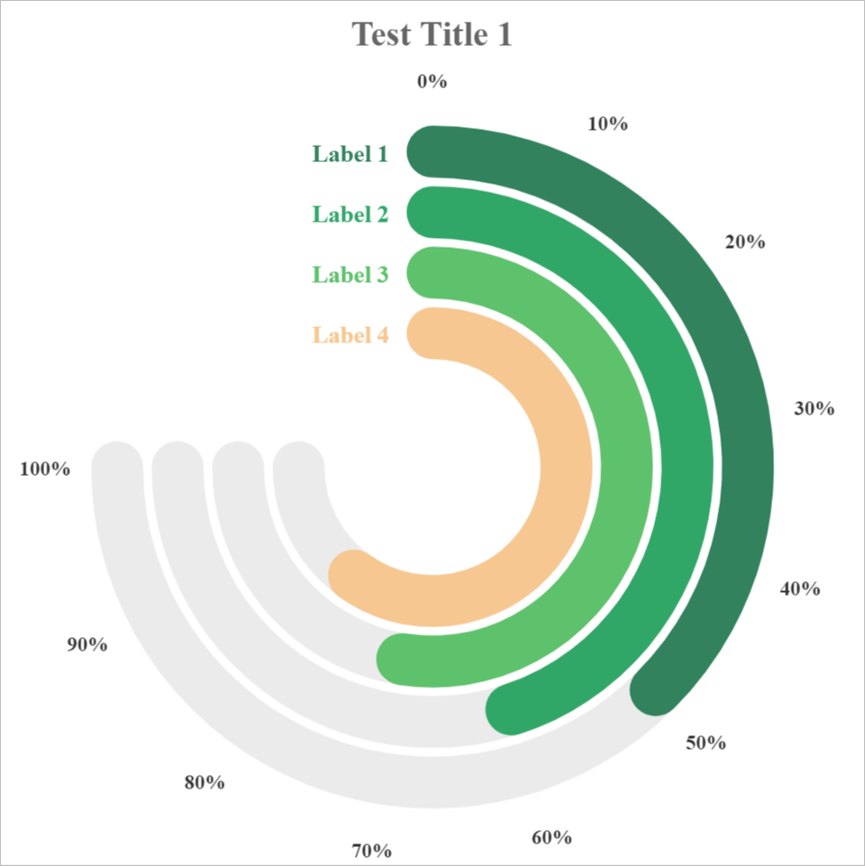

# Solid Gauge

### Sample



**Title**

```javascript
{
    text: "Test Title 1",
    ...
}
```

**Subtitle**

```javascript
{
    text: "",
    ...
}
```

**Legend**

```javascript
{
	enabled: false,
    ...
}
```

**Options**

```javascript
Table(
    { key: "solidGauge.minRadius", value: "0.3" }
)
```

**Data**

```javascript
{
    legends: ["Test 1", "Test 1"],
    labels: ["Label 1","Label 2","Label 3","Label 4","Label 5"],
    table: Table(
        { key:"values", values: [90, 20, 40, 80, 50] }
    )
}
```

### All Options

| Key                  | Remark                                                       |
| -------------------- | ------------------------------------------------------------ |
| solidGauge.itemGap   | Gap between 2 items. The default value is `5`.               |
| solidGauge.minRadius | Min radius of the solid gauge chart. The default value is `0.3`. |

You can also change the style of [X Axis](axes.md?id=x-axis) and [Y Axis](axes.md?id=y-axis) of the chart by following options.

| Key | Default Value |
|:-|:-:|
| x.labels.fontSize | `12` |
| x.labels.fontFamily |  |
| x.labels.fontWeight | `bold` |
| x.labels.fontStyle | `normal` |
| x.labels.color |  |
| x.labels.additionalStyles |  |
| y.labels | `true` |
| y.labels.fontSize | `12` |
| y.labels.fontFamily |  |
| y.labels.fontWeight | `bold` |
| y.labels.fontStyle | `normal` |
| y.labels.color | `#333333` |
| y.labels.additionalStyles |  |
